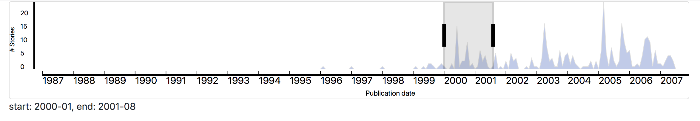

A standalone interactive timeline plot built w/ React and SVG and used in [Rookie](https://arxiv.org/pdf/1708.01944.pdf).

#### Setup

```
$ git clone git@github.com:AbeHandler/ReactTimeline.git
$ npm i
$ npm run build // builds to public/bundle.js and watches
```

Then in a separate terminal 

```
$ cd public && python -m http.server
```

#### Expected output


